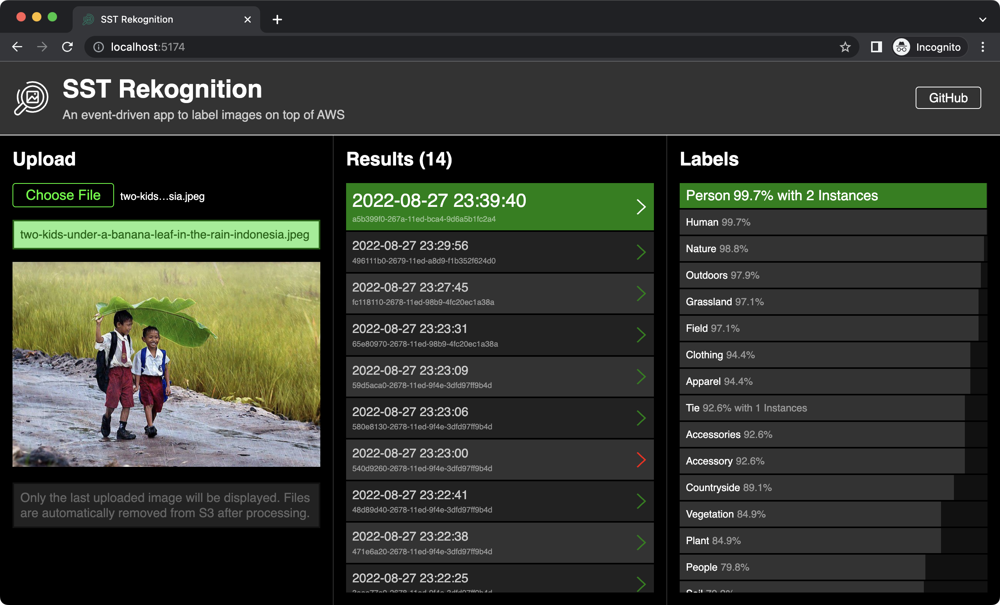

# SST Rekognition

### An event-driven app to label images on top of AWS using SST (Serverless Stack), TypeScript, and React.

### Step-by-Step Tutorial (build your own app)

https://github.com/jpbarbosa/sst-rekognition/wiki

### Including

- API Gateway
- DynamoDB
- EventBridge / Event Bus
- Lambda Functions
- Rekognition
- Simple Queue Service (SQS)
- Simple Storage Service (S3)
- React Frontend

### Diagram

### Screenshot

Image labeled in the above example by Kendisan Seruyan: https://1x.com/photo/56370

### References

- [SST](https://sst.dev) (the awesome tool that made this app possible)
- [AWS Docs - Detecting labels in an image](https://docs.aws.amazon.com/rekognition/latest/dg/labels-detect-labels-image.html)
- [AWS Blog - Use Amazon S3 Event Notifications with Amazon EventBridge](https://aws.amazon.com/blogs/aws/new-use-amazon-s3-event-notifications-with-amazon-eventbridge/)
- [YouTube - What is Event Driven Architecture?](https://youtu.be/DQ5Cbt8DQbM)
- [YouTube - Amazon S3 Event Notifications with Amazon EventBridge](https://youtu.be/k-jEuNb_KBM)
- [Medium - Add Objects to a Bucket Using a Browser-Side Script with AWS SDK and Cognito](https://medium.com/@KerrySheldon/s3-exercise-2-3-add-content-to-a-bucket-using-a-browser-side-script-with-aws-sdk-and-cognito-93beb4fc1151)
